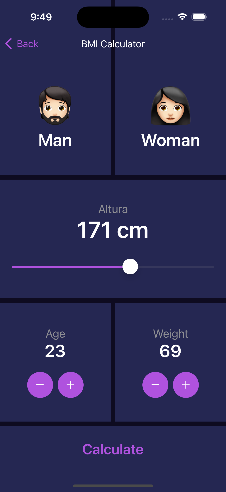
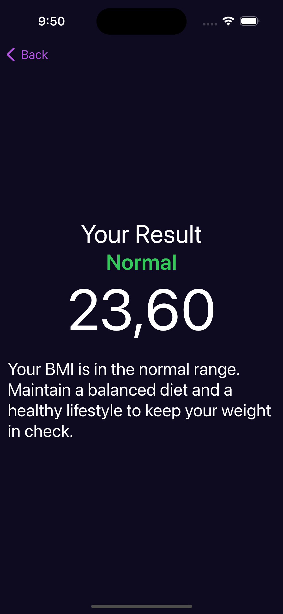

# Swift BMI Calculator

## Description
`Swift BMI Calculator` is an application developed in Swift that allows you to calculate a person's Body Mass Index (BMI). BMI is a measure used to determine if a person has a healthy weight in relation to their height.

## Features
- **BMI Calculation**: Enter your weight and height to get your BMI.
- **User-friendly Interface**: Intuitive and easy-to-use design.

## Screenshots

| **BMI Calulator** | **BMI Result** |
|:-----------------------:|:-----------------------:|
|  |  |


## Requirements
- Xcode 12 or later
- iOS 14.0 or later

## Installation
1. Clone this repository:
    ```sh
    git clone https://github.com/your-username/swift-bmi-calculator.git
    ```
2. Open the project in Xcode:
    ```sh
    cd swift-bmi-calculator
    open swift-bmi-calculator.xcodeproj
    ```
3. Build and run the application on a simulator or physical device.

## Usage
1. Enter your weight in kilograms.
2. Enter your height in meters.
3. Press the calculate button to get your BMI and its classification.

## Contributions
Contributions are welcome. Please follow these steps:
1. Fork the repository.
2. Create a new branch (`git checkout -b feature/new-feature`).
3. Make your changes and commit them (`git commit -am 'Add new feature'`).
4. Push your changes (`git push origin feature/new-feature`).
5. Open a Pull Request.

## License
This project is licensed under the MIT License. See the [LICENSE](LICENSE) file for details.